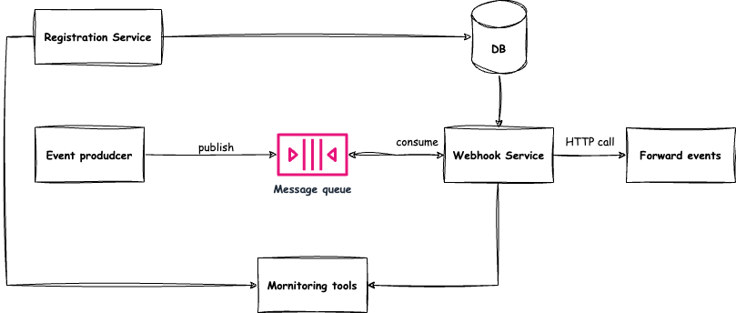
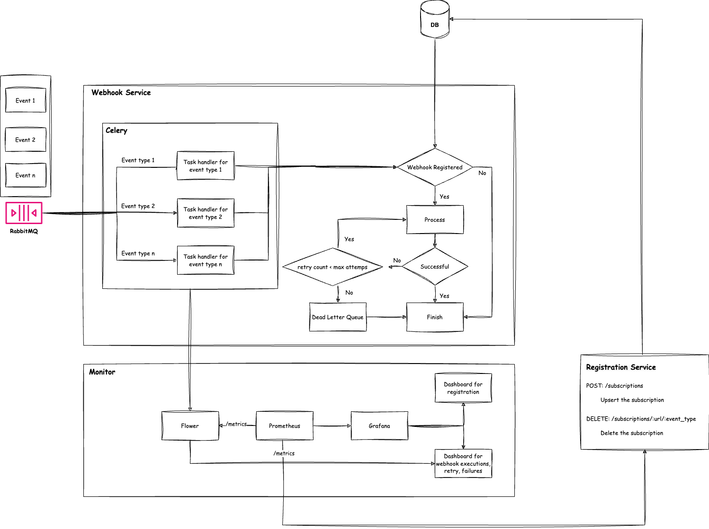

# Webhook System Overview

This is a simple webhook system that allows you to register a webhook and then send a POST request to the registered URL. The system will then forward the request to the registered URL.


## Architecture

### High Level Architecture

The image below shows the high-level architecture of the system.



The system is composed of the following components:

- **Registration Service**: This is a RESTful API that allows you to register a webhook and store the configuration to the database. The API is implemented using Flask.

- **Database**: This is a PostgreSQL database that stores the webhook configuration.

- **Messagge Queue**: This is a RabbitMQ message queue that is used to decouple the registration service from the webhook service. The registration service will send a message to the message queue when some specific events happened. The webhook service will then consume the message from the queue and forward the request to the registered URL.

- **Webhook Service**: This is a service that consumes the message from the message queue and forwards the request to the registered URL. The service is implemented using Celery.

- **Monitoring Service**: This is a service that monitors the system. The service is implemented using Flower, Prometheus and Grafana.

### Detailed Level Architecture

The detailed architecture of the system is shown in the image below.



The detailed architecture shows the internal components of the registration service, webhook service and monitoring service.

The workflow of the registration service is as follows:

1. The user sends a POST request to the registration service to configure a webhook.

    - To update an existing subscription, you must specify both the Event Type and the URL of the original subscription.

    - If the Event Type and URL combination is not found, a new subscription will be created.

2. The registration service will store the webhook configuration to the database.

The workflow of the webhok execution is as follows:

1. The event producer sends events (with event type) to the message queue.

2. The message queue will forward the events to the Celery worker. Based on the event type, the RabbitMQ will forward the event to the approriate Celery task.

3. The Celery worker will fetch the webhook configurations from the database based on the event type and then send the request to the registered URL.

4. If the request is failed, the Celery worker will retry the request based on the retry configuration. If the request is still failed after the retry, the Celery worker will send the failure event to the dead letter queue.

5. The monitoring service will monitor the system and store the metrics to the Prometheus database. The Grafana will then visualize the metrics from the Prometheus database.


## How to run the system

### Prerequisites

- Docker
- Docker Compose

### Steps

1. Clone the repository

```bash
git clone https://github.com/toantranct94/webhook-sfx.git
```

3. Run the system

```bash
docker-compose up
```

### Unit Tests

To run the unit tests, you can run the following command:

- Test the registration service

```bash
cd registration-service
pytest tests
```

### API Documentation

Not implemented the Swagger API documentation yet.

### Event Types

The following are the event types that you can use to register a webhook:

- **created**: The event is triggered when a new resource is created.

- **updated**: The event is triggered when a resource is updated.

- **deleted**: The event is triggered when a resource is deleted.

### Config the webhook subscription

You can config the webhook subscription by sending a POST request to the registration service. The following is an example of the requests:

- Upsert a webhook subscription

```bash
curl --location 'http://127.0.0.1:5000/subscriptions/' \
--header 'Content-Type: application/json' \
--data '{
    "url": "http://127.0.0.1:5000/callback",
    "event_type": "created",
    "custom_headers": {
        "Authorization": "Bearer token",
        "Content-Type": "application/json"
    },
    "custom_payload": {
        "key1": "value1",
        "key2": "value2"
    }
}'
```

- Delete a webhook subscription

```bash
curl --location --request DELETE 'http://127.0.0.1:5000/subscriptions/http:~~example.com~webhook-endpoint/my_event1'
```

### Testing the webhook trigger

I have implemented some simple APIs that allows you to trigger the webhook. You can send requests to the following URLs to trigger the webhook:

- Trigger the created event

    ```bash
    curl --location 'http://127.0.0.1:8000/people/' \
    --header 'Content-Type: application/json' \
    --data-raw '{
        "role": "1",
        "email": "toantran@gmail.com"
    }'
    ```

- Trigger the updated event
    - URL: `http://127.0.0.1:8000/people/:people_id`
    ```bash
    curl --location --request PUT 'http://127.0.0.1:8000/people/1' \
    --header 'Content-Type: application/json' \
    --data '{
        "role": "2"
    }'
    ```

- Trigger the deleted event
    - URL: `http://127.0.0.1:8000/people/:people_id`
    ```bash
    curl --location --request DELETE 'http://127.0.0.1:8000/people/1' \
    --header 'Content-Type: application/json'
    ```

### Monitoring

The monitoring service is implemented using Flower, Prometheus and Grafana. You can access the monitoring dashboard by accessing the following URLs:

- Flower: http://localhost:5555

- Prometheus: http://localhost:9090

- Grafana: http://localhost:3000


## Future Work

- Implement the Swagger API documentation for the registration service.

- Implement dead letter queue for the failed requests after the retry.
